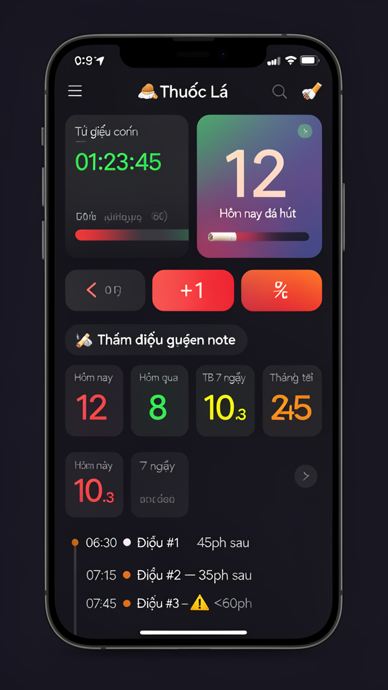
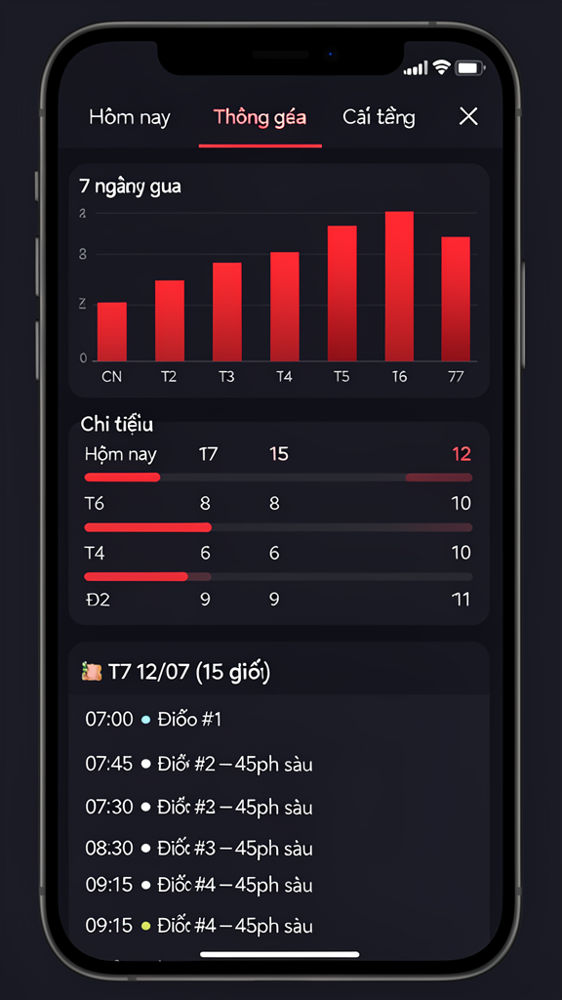
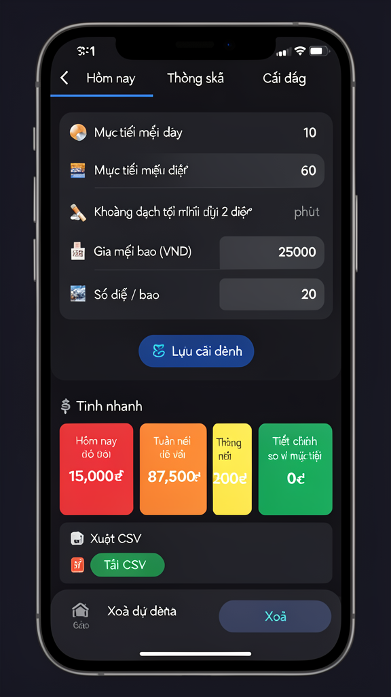

# 🚬 Thuốc Lá Tracker

PWA đếm số điếu thuốc đã hút trong ngày — nhẹ, nhanh, không cần cài app.

## 📸 Giao diện

| Trang chính | Thống kê | Cài đặt |
|---|---|---|
|  |  |  |

## Tính năng

- ➕ **Đếm +1 🚬** và **½** — bấm nhanh, haptic feedback
- ↩️ **Undo** — xoá điếu vừa bấm nhầm
- ⏪ **Thêm điếu quên note** — quên hồi sáng? chọn giờ cũ + thêm
- ✏️ **Sửa / xoá từng điếu** — chạm vào timeline
- 🎯 **Mục tiêu ngày** — thanh progress báo % hoàn thành
- ⏱️ **Timer từ điếu cuối** — real-time, biết đã được bao lâu
- ⏱️ **Mục tiêu khoảng cách** — cảnh báo nếu hút gần nhau quá
- 💰 **Tính tiền tự động** — nhập giá bao, tính hôm nay/tuần/tháng
- 📊 **Biểu đồ 7 ngày** + timeline chi tiết
- 📋 **Xem chi tiết ngày** — bấm vào cột biểu đồ hoặc dòng ngày, hiện từng điếu
- 📤 **Xuất CSV** — tải về làm báo cáo
- 📱 **PWA** — Add to Home Screen, xài offline

## Cài đặt

1. Mở https://thuocla-tracker.vercel.app
2. Trên iOS: Safari → Share → **Add to Home Screen**
3. Trên Android: Chrome → **⋮ → Install app / Add to Home Screen**

## Dev

```bash
git clone https://github.com/dinhtrung/thuocla-tracker.git
cd thuocla-tracker
python3 -m http.server 8080
# Mở http://localhost:8080
```
