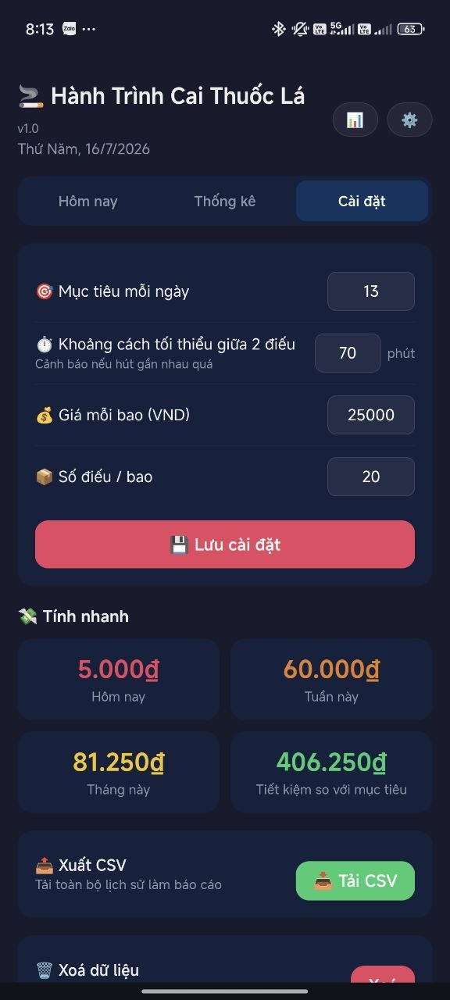
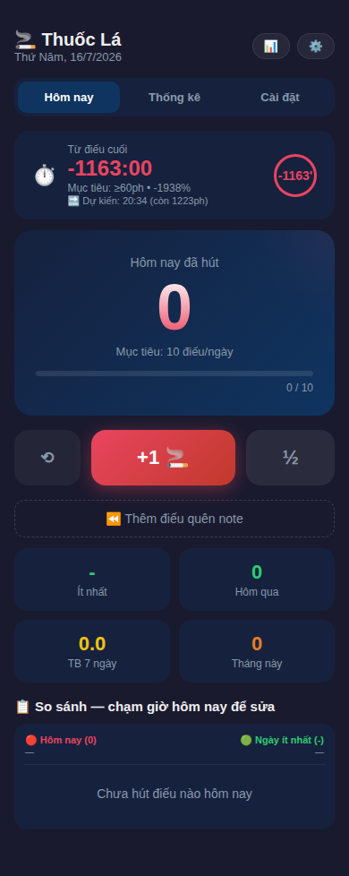
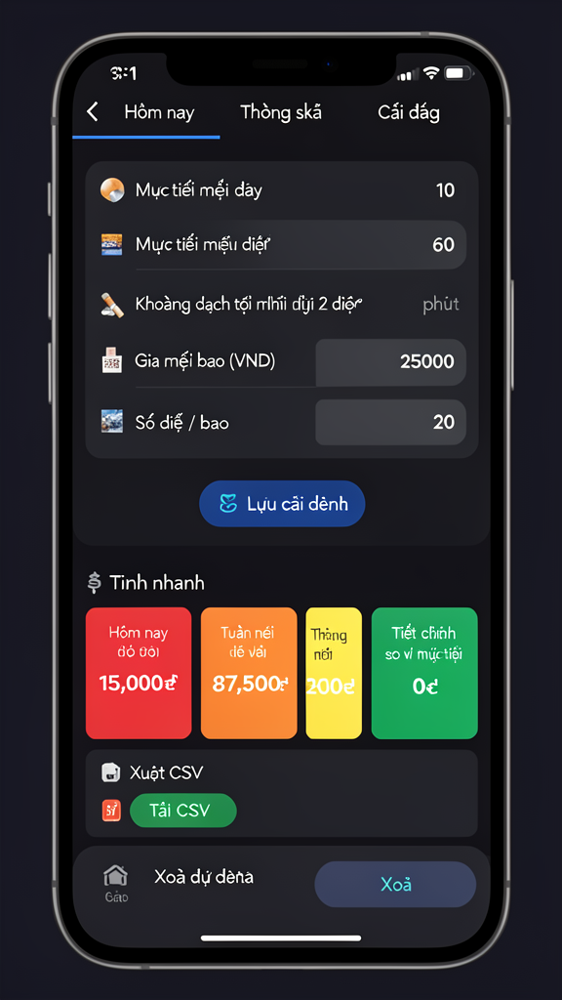

# 🚬 Thuốc Lá Tracker

PWA đếm số điếu thuốc đã hút trong ngày — nhẹ, nhanh, miễn phí, không cần cài app. *[Changelog](CHANGELOG.md) • v1.4.6*

## 📸 Giao diện

| Trang chính | Thống kê | Cài đặt |
|:---:|:---:|:---:|
|  |  |  |

## ✨ Tính năng

- **➕ Đếm +1 🚬** — bấm nhanh, haptic feedback
- **💡 Chọn lý do hút** — popup sau +1 (🍜 Sau ăn, ☕ Cà phê, 😤 Stress, 🍻 Nhậu…), icon hiện ngay trong timeline
- **↩️ Undo** — xoá điếu vừa bấm nhầm
- **⏪ Thêm điếu quên note** — quên hồi sáng? chọn giờ cũ + thêm
- **✏️ Sửa / xoá từng điếu** — chạm vào dòng so sánh
- **🎯 Mục tiêu ngày** — thanh progress báo % hoàn thành
- **⏱️ Timer từ điếu cuối** — real-time, biết đã được bao lâu
- **⏱️ Mục tiêu khoảng cách** — cảnh báo nếu hút gần nhau quá
- **🚨 Alert thông minh** — chain-smoke (≤30ph), khung giờ đỉnh, hút nhanh liên tiếp
- **📋 So sánh song song** — giờ hút hôm nay vs ngày ít nhất
- **💰 Tính tiền tự động** — nhập giá bao, tính hôm nay/tuần/tháng
- **📊 Biểu đồ SVG 7 ngày** — chuẩn pixel, có 🎯 đường mục tiêu
- **📅 Lật tuần** — ‹ › xem các tuần trước
- **📋 Xem chi tiết ngày** — bấm vào cột biểu đồ, hiện từng điếu
- **📊 Tab Insights** — so sánh tuần, phân tích giấc ngủ, thử thách, biểu đồ "✂️ Cửa sổ cắt"
- **📤 Xuất CSV** — tải về làm báo cáo
- **📱 PWA** — Add to Home Screen, xài offline, **tự cập nhật** khi có bản mới (không cần refresh tay)

## 🚀 Dùng thử

Mở [thuocla-tracker.vercel.app](https://thuocla-tracker.vercel.app)
- iOS: Safari → Share → **Add to Home Screen**
- Android: Chrome → **⋮ → Install app / Add to Home Screen**

## 🛠 Dev

```bash
git clone https://github.com/dinhtrung/thuocla-tracker.git
cd thuocla-tracker
python3 -m http.server 8080
# Mở http://localhost:8080
```

## 📦 Tech stack

- HTML + CSS + Vanilla JS (PWA)
- localStorage — không cần server, không đăng nhập
- SVG — biểu đồ chính xác, responsive
- Service Worker — offline + auto-update
- Vercel — deploy tự động từ GitHub
